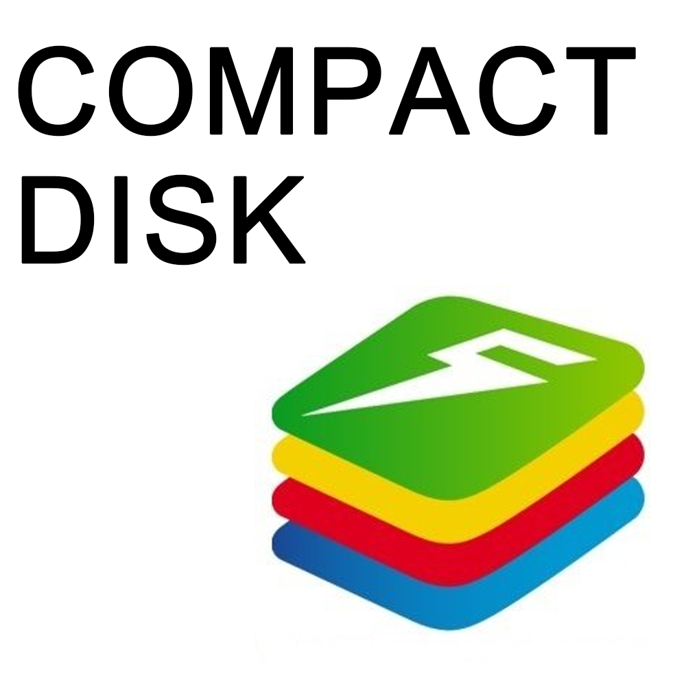
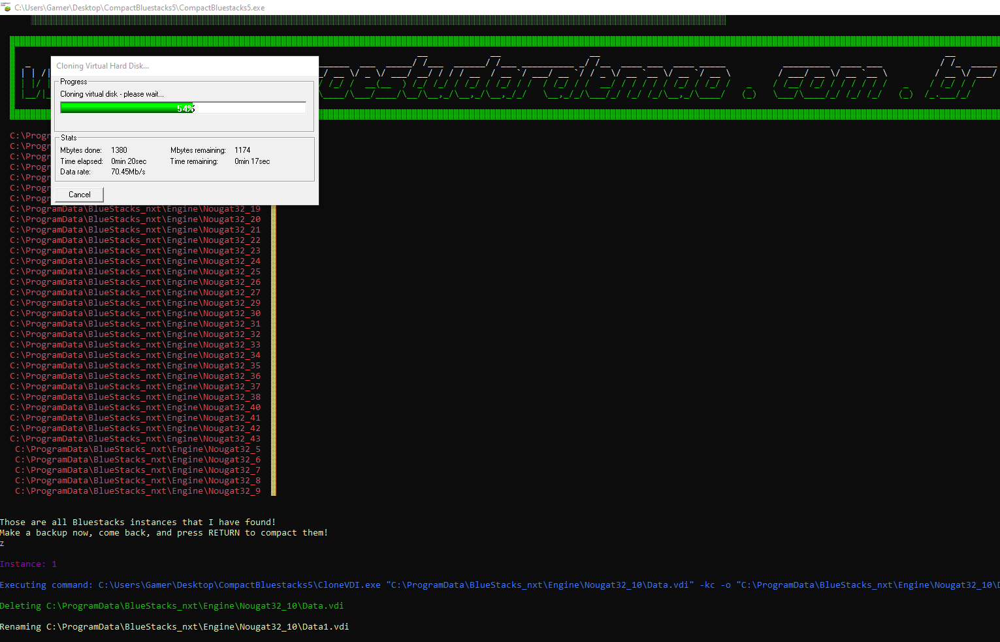

 

# BluestacksCompact5 [DOWNLOAD THE INSTALLER HERE!](https://github.com/hansalemaos/CompactBluestacks5/raw/main/CompactBluestacks5_setup.exe)

- We all love Bluestacks since it certainly is the best emulator for Android, but unfortunately it behaves like a child with a tumor in the pituitary gland. It keeps growing and growing in size. For version 4 there was a solution provided by Bluestacks itself, but for version 5, it has not been released yet. Since I got tired of installing more than 30 instances over and over again, I made a little script which reduces the size of all installed Bluestacks 5 instances.Since there are a lot of people who do not know how to use Python, I also created an EXE file.

## What can you do with it?

- Compact virtual HDDs from all your Bluestacks 5 instances to save disk space! It was included in v4, but has not been released yet for v5. Because of that, I wrote this app!

## How to install/run?

- You can either download the installer (for people who do not know about programming) or the Python script and run it.
- Start the app.
- The app will show you all instances found
- Be sure to make a backup of those folders! 
- Write "ok" and press ENTER
- I have tested it only with Nougat32 (standard Bluestacks 5 version)

## Donations 

If this project has helped you somehow, consider donating a small amount. After being absent from computer programming for more than 20 years, I started again this year. At the beginning of 2021, I suffered from a bone infection and had to spend more than 3 months in hospital (only laying in bed!). To kill time, I stared learning Python, which rapidly became something bigger for me than just a "time killer".

